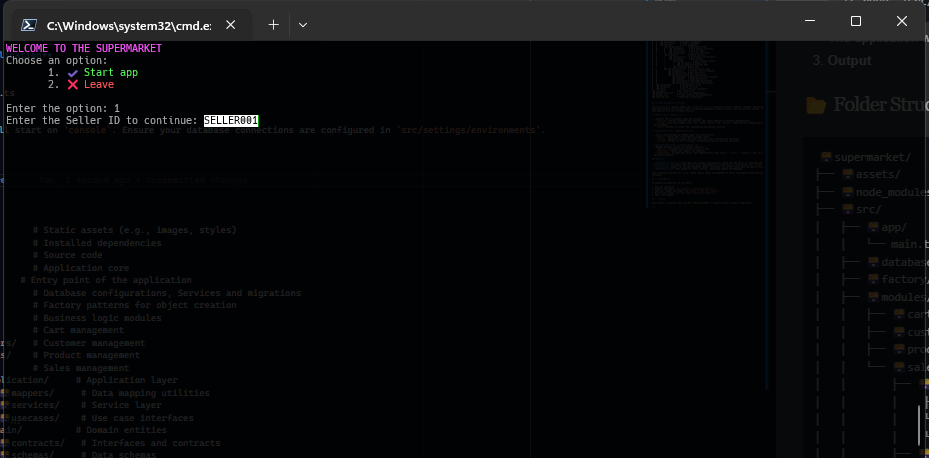
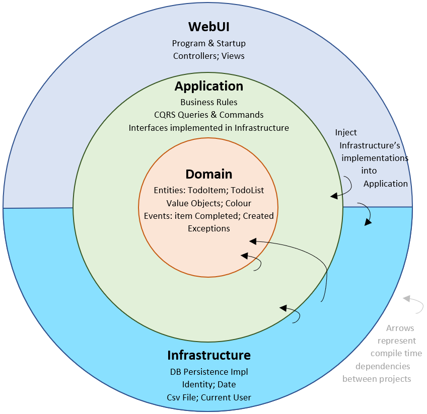

# 🛒 Supermarket Project

The **Supermarket** project is a comprehensive application designed to manage supermarket operations, including inventory, sales, and customer interactions. Built with TypeScript, and supported by multiple databases (MySQL, PostgreSQL, SQL Server), it provides a scalable solution for tracking products, processing transactions, and generating reports (Remember every is to console). The project leverages Queues for efficient task management and HashMap for fast data retrieval and storage, enhancing performance and scalability.

## 📋 Table of Contents

- [Prerequisites](#-prerequisites)
- [Installation](#-installation)
- [Running the Project](#-running-the-project)
- [Folder Structure](#-folder-structure)
- [Clean Architecture Overview](#-clean-architecture-overview)
- [Contributing](#-contributing)
- [License](#-license)

## 🛠️ Prerequisites

Before you begin, ensure you have the following installed:

- [npm](https://www.npmjs.com/) (v11.x or higher)
- [Git](https://git-scm.com/) for cloning the repository
- [Visual Studio Code](https://code.visualstudio.com/) or your preferred IDE
- [TypeScript](https://www.typescriptlang.org/) (installed via `npm install -g typescript`)
- Database clients: MySQL, PostgreSQL, SQL Server and Mockup for test

## 📦 Installation

1. **Clone the Repository**

   ```bash
   git clone https://github.com/gitmariosalazar/supermarket.git
   ```

2. **Navigate to the Project Directory**

   ```bash
   cd ./supermarket/supermarket
   ```

3. **Open the Project in Your IDE**

   ```bash
   code .
   ```

4. **Install Dependencies**
   ```bash
   npm install
   ```

## 🚀 Running the Project

1. **Start the Development Application**

   ```bash
   npm run start
   ```

2. **Run the Main Application**

   ```bash
   ts-node ./src/main.ts
   ```

   The application will start on `console`. Ensure your database connections are configured in `src/settings/environments`.
   Use `SELLER001` or `SELLER002` to start The Application

3. **Output**
   

## 📂 Folder Structure

```
🗃️supermarket/
├── 🗃️assets/              # Static assets (e.g., images, styles)
├── 🗃️node_modules/        # Installed dependencies
├── 🗃️src/                 # Source code
│   ├── 🗃️app/             # Application core
│   │   └── main.ts      # Entry point of the application
│   ├── 🗃️database/        # Database configurations, Services and migrations
│   ├── 🗃️factory/         # Factory patterns for object creation
│   ├── 🗃️modules/         # Business logic modules
│   │   ├── 🗃️carts/       # Cart management
│   │   ├── 🗃️customers/   # Customer management
│   │   ├── 🗃️products/    # Product management
│   │   └── 🗃️sales/       # Sales management
│   │       ├── 🗃️application/     # Application layer
│   │       │    ├── 🗃️mappers/     # Data mapping utilities
│   │       │    └── 🗃️services/    # Service layer
│   │       │    └── 🗃️usecases/    # Use case interfaces
│   |       ├── 🗃️domain/          # Domain Layer
│   │       |    ├── 🗃️contracts/   # Interfaces and contracts
│   │       |    └── 🗃️schemas/     # Data schemas
│   │       |        └── 🗃️dto/         # Data transfer objects
│   │       |        |   ├── 🗃️request/ # Request DTOs
│   │       |        |   └── 🗃️response/# Response DTOs
|   |       |        └── 🗃️models/ Model Class
│   |       └── 🗃️infrastructure/  # Infrastructure layer
│   │           ├── 🗃️adapters/    # External service adapters
│   │           ├── 🗃️controllers/ # API controllers
│   │           └── 🗃️repositories/# Data repositories
│   │               └── 🗃️mockup/  # Database Persistence Mockup
│   │               ├── 🗃️mysql/   # MySQL Persistence
│   │               ├── 🗃️postgres/# PostgreSQL Persistence
│   │               └── 🗃️sqlserver/# SQL Server Persistence
│   ├── 🗃️settings/        # Configuration files
│   ├── 🗃️shared/          # Shared utilities
│   └── 🗃️ui/              # User interface components
├── .gitignore           # Git ignore file
├── package-lock.json    # Lock file for dependencies
├── package.json         # Project metadata and dependencies
└── tsconfig.json        # TypeScript configuration
```

## 🧩 Clean Architecture Overview

The **Supermarket** project adopts the **Clean Architecture** pattern to ensure a modular, testable, and maintainable codebase. This design separates concerns into distinct layers, promoting independence between business logic and external systems. The `sales` module exemplifies this approach with the following structure:

- **Domain Layer (`domain/`)**:

  - Contains the core business logic and entities.
  - `contracts/` defines interfaces and contracts that remain agnostic of external implementations.
  - `schemas/` holds data schemas, while `dto/` (with `request/` and `response/` subdirectories) manages Data Transfer Objects for clean data exchange.
  - `models/` includes the model class representing the business entities.

- **Application Layer (`application/`)**:

  - Acts as the intermediary between domain and infrastructure.
  - `mappers/` handles data transformation between layers.
  - `services/` implements business use cases with logic that interacts with the domain.
  - `usecases/` defines use case interfaces, encapsulating specific business operations.

- **Infrastructure Layer (`infrastructure/`)**:
  - Manages external systems and technical concerns.
  - `adapters/` integrates with external services or APIs.
  - `controllers/` handles API requests and responses.
  - `repositories/` provides data access, with subdirectories like `mockup/`, `mysql/`, `postgres/`, and `sqlserver/` supporting multiple persistence options.



### Benefits

- **Separation of Concerns**: Each layer has a single responsibility, making the code easier to understand and modify.
- **Testability**: The domain layer can be tested independently of infrastructure, using mockups from `mockup/`.
- **Flexibility**: Support for multiple databases (MySQL, PostgreSQL, SQL Server) allows easy switching or extension of persistence layers.
- **Maintainability**: Clear boundaries reduce coupling, simplifying updates and debugging.

This architecture ensures the `sales` module remains robust and adaptable to future requirements while adhering to Clean Architecture principles.

## 🤝 Contributing

We welcome contributions! To contribute:

1. Fork the repository.
2. Create a new branch (`git checkout -b feature/your-feature`).
3. Make your changes and commit (`git commit -m "Add your feature"`).
4. Push to your branch (`git push origin feature/your-feature`).
5. Open a Pull Request.

## 📜 License

This project is licensed under the [MIT License](LICENSE) (or specify another license if applicable).

## 📱 Connect With Me

- 👨🏻‍💻 Author - [Mario Salazar](https://mssalazar.com)
- 🌐 Website - [https://mssalazar.com](https://mssalazar.com)
- 📲 WhatsApp - [Send message](https://wa.link/pl94td)
- 📸 Instagram - [@mario10salazar](https://www.instagram.com/mario10salazar/)

---
